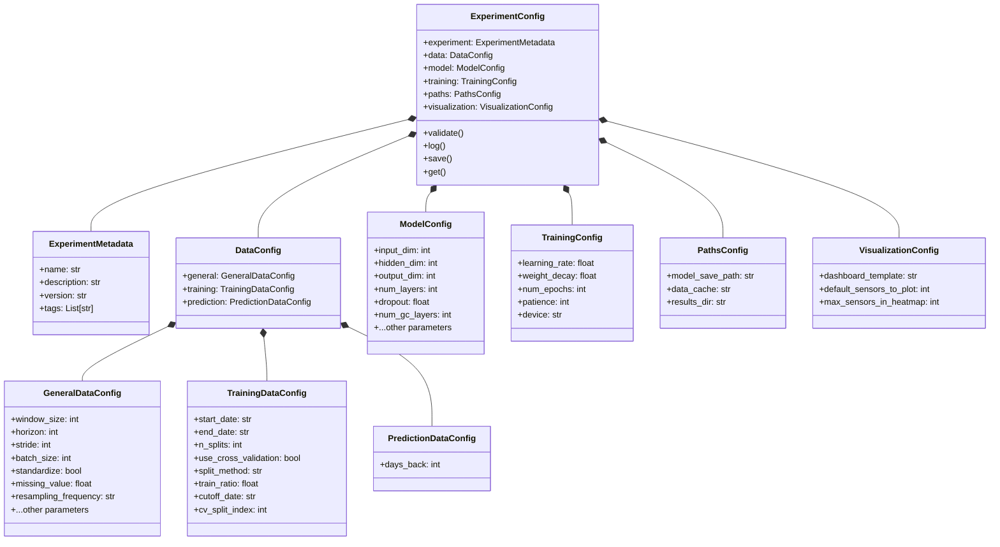
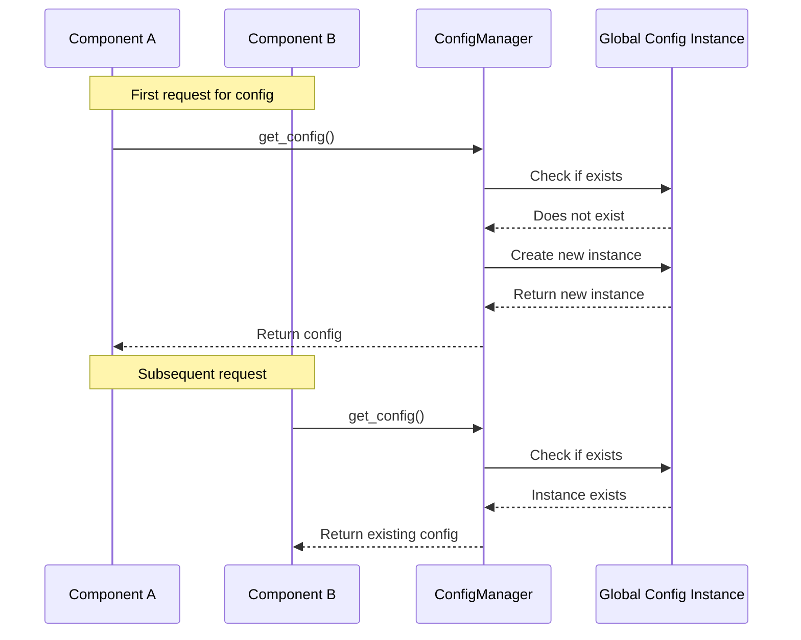
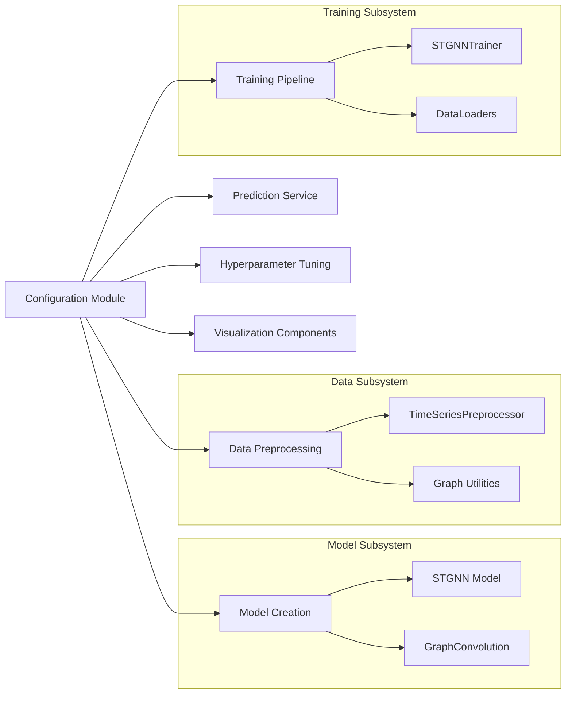
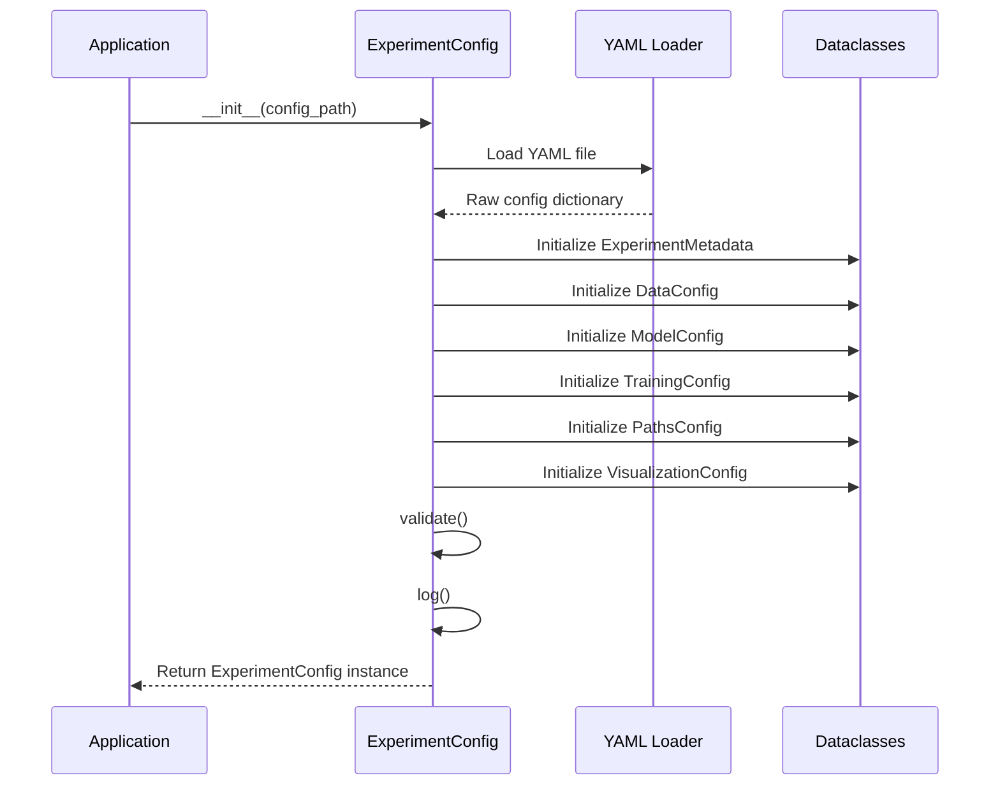

# GNN Package Configuration Module Documentation

The configuration module in the GNN package provides a centralised system for managing settings across the entire application. It uses a hierarchical structure to organise configuration parameters and supports loading configurations from YAML files, overriding settings programmatically, and validating settings.

## Configuration Architecture Overview

The configuration system consists of several key components:

1. `ExperimentConfig`: The main configuration class that loads, validates, and provides access to configuration settings
2. Configuration dataclasses: Specialised dataclasses for different configuration categories (`DataConfig`, `ModelConfig`, etc.)
3. `ConfigManager`: Utilities for working with configurations (loading, creating defaults, etc.)

Let's examine how these components work together and how the rest of the package interacts with them.

## Configuration Hierarchy

The configuration follows a hierarchical structure to organise settings by domain:




## Key Components

### `ExperimentConfig`

The `ExperimentConfig` class is the main entry point for accessing configuration settings. It loads a YAML configuration file and initialises the various configuration dataclasses.

#### Key methods:

* `__init__(config_path)`: Loads configuration from a YAML file
* `validate()`: Checks that all required parameters are present
* `log()`: Logs the configuration details
* `save(path)`: Saves the configuration to a YAML file
* `get(key, default)`: Accesses configuration values using dot notation

#### Example usage:

```python
# Load a configuration
config = ExperimentConfig('config.yml')

# Access configuration values
window_size = config.data.general.window_size
learning_rate = config.training.learning_rate

# Save updated configuration
config.save('updated_config.yml')
```

### Configuration Dataclasses

Specialised dataclasses for different configuration domains provide type hints and structured access to settings.

#### Example:

```python
@dataclass
class GeneralDataConfig:
    """Configuration for data processing shared across training and prediction."""
    window_size: int = 24
    horizon: int = 6
    stride: int = 1
    # ...more parameters
```

### `ConfigManager`

The `config_manager.py` module provides utilities for working with configurations:

* `get_config()`: Gets the global configuration instance
* `reset_config()`: Resets the global configuration instance
* `create_default_config()`: Creates a default configuration file
* `load_yaml_config()`: Loads a YAML configuration file

## Global Configuration Singleton

The configuration system implements a singleton pattern to maintain a single, global configuration instance:



## Interactions with Other Modules

The configuration system interacts with many other modules in the package:



### Data Preprocessing

The configuration guides how data is processed:

* Window size and horizon for time series segmentation
* Resampling frequency and normalisation parameters
* Train/validation split parameters

```python
# Example: Using config in TimeSeriesPreprocessor
processor = TimeSeriesPreprocessor(config=config)
split_data = processor.create_rolling_window_splits(resampled_data, config=config)
```

### Model Creation

Model architecture is defined by configuration parameters:

* Hidden dimensions, layers, and dropout
* Graph convolution parameters
* Input and output dimensions

```python
# Example: Creating a model from config
model = create_stgnn_model(config=config)
```

### Training

Training hyperparameters are stored in the configuration:

* Learning rate and weight decay
* Number of epochs and early stopping patience
* Device selection (CPU/GPU/MPS)

```python
# Example: Training with config
trainer = STGNNTrainer(model, config)
results = train_model(data_loaders=data_loaders, config=config)
```

### Prediction

Prediction services use configuration to determine:

* How far back to retrieve historical data
* Frequency of predictions
* Which model parameters to use


```python
# Example: Creating prediction config
prediction_config = create_prediction_config()
```

## Tips for Working with the Configuration System

Always use the global instance when possible:

```python
from gnn_package.config import get_config
config = get_config()
```

Access config properties consistently:

```python
# Good - direct attribute access
window_size = config.data.general.window_size

# Also good - using get() with default
window_size = config.get("data.general.window_size", default=24)
```

For prediction, create a specialised config:

```python
from gnn_package.src.utils.config_utils import create_prediction_config
prediction_config = create_prediction_config()
```

Validate after modifications:

```python
# After updating config settings
config.validate()
```

Save configuration alongside results:

```python
# When saving experiment results
config.save(output_dir / "config.yml")
```

## Under the Hood: Configuration Loading

When a configuration file is loaded, it follows this process:



## Summary
The configuration system in the GNN package provides a centralised, type-safe way to manage settings across the entire application. By using a hierarchical structure with specialised dataclasses, it ensures that components have access to the settings they need in a consistent and validated format.

This approach offers several benefits:

* Clear organisation of settings by domain
* Type hints and validation for configuration values
* Centralised management of global settings
* Easy serialisation to and from YAML files
* Support for both global singleton and explicit configuration instances

Understanding how this configuration system works will help you effectively customise and extend the GNN package for your specific needs.