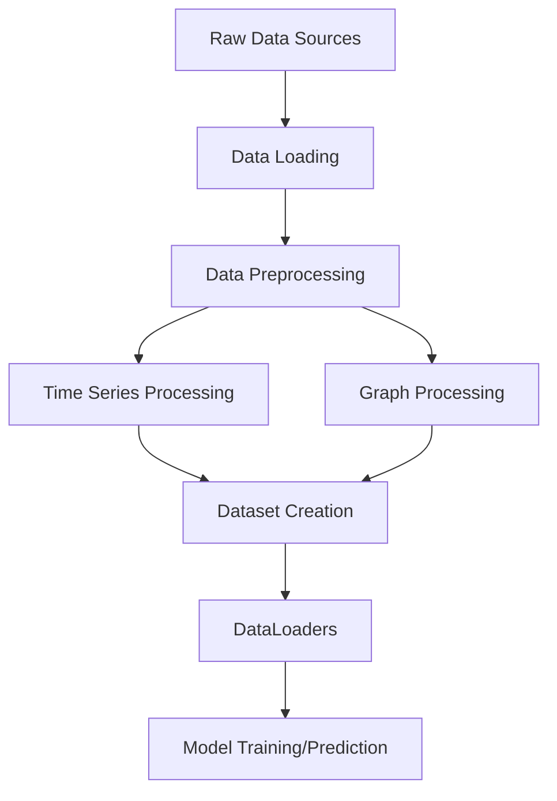
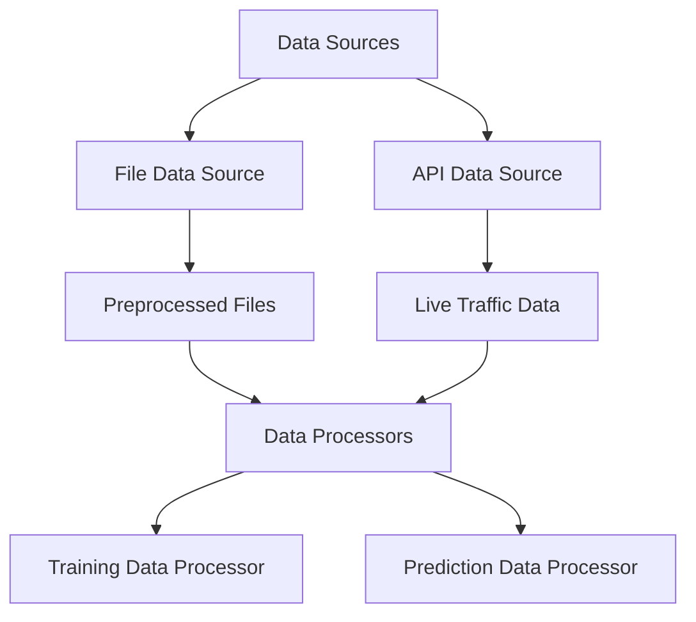
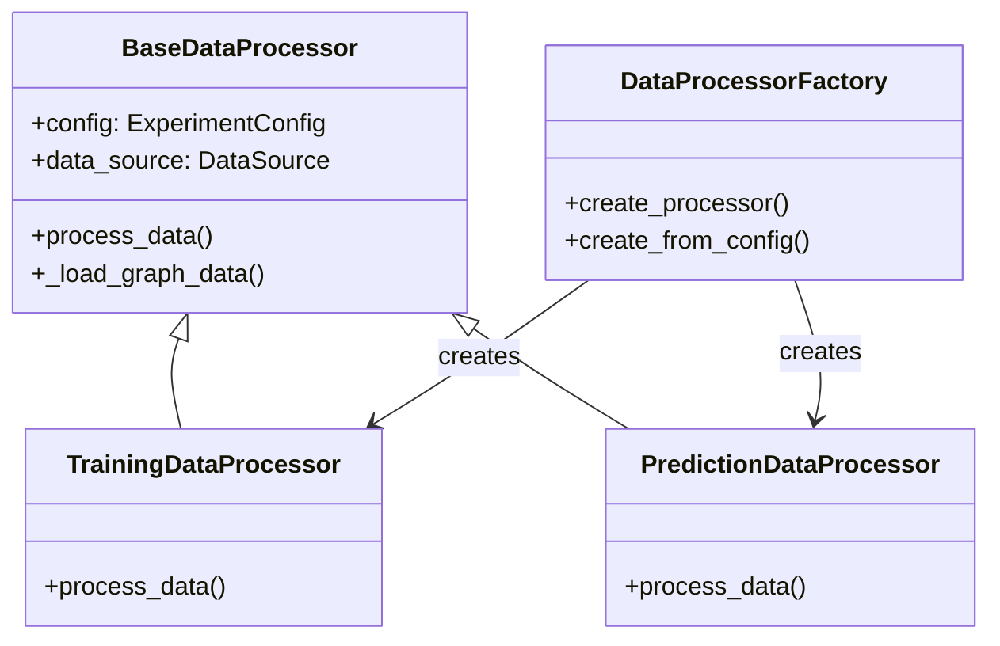
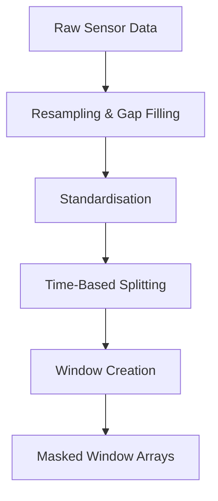
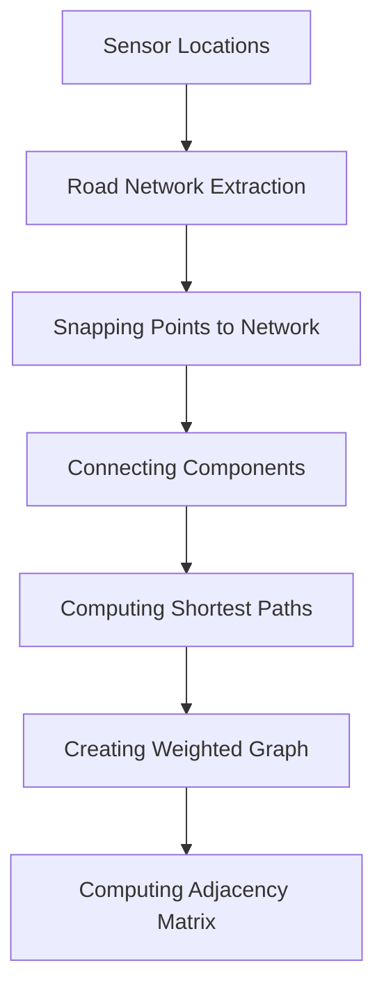
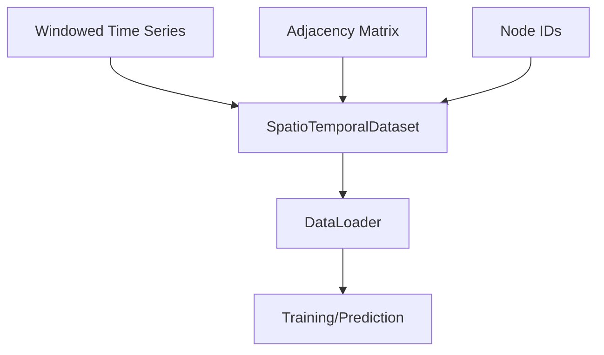

# GNN Package Data Flow Documentation

This document describes the data flow through the GNN package, from initial data loading to preprocessed datasets ready for model training and prediction.

## Data Flow Overview

The data pipeline in the GNN package handles two primary types of data:

1. **Time Series Data**: Traffic counts from sensors over time
2. **Graph Data**: Spatial relationships between sensors represented as a weighted adjacency matrix

These data sources are processed through a series of steps and combined to create spatio-temporal datasets for model training and prediction.

## High-Level Data Flow



## Data Sources and Loading

The package can load data from multiple sources:



### FileDataSource

Used for loading historical data from files:

```python
data_source = FileDataSource(data_file)
data_dict = await data_source.get_data(config)
```

Key file:
- `src/data/data_sources.py`

### APIDataSource

Used for fetching recent data directly from the API:

```python
data_source = APIDataSource()
data_dict = await data_source.get_data(config)
```

This source uses the `private_uoapi` package to fetch live traffic data and applies the sensor name to ID mapping.

## Data Processors

The `DataProcessor` classes manage the overall flow of data processing:



The `DataProcessorFactory` creates the appropriate processor based on the mode:

```python
processor = DataProcessorFactory.create_processor(
    mode=ProcessorMode.TRAINING,
    config=config,
    data_source=data_source
)
```

### Data Processor Output

The processors return a standardised dictionary with the following structure:

```
{
    "data_loaders": {
        "train_loader": train_loader,  # Only in training mode
        "val_loader": val_loader,      # In both modes
    },
    "graph_data": {
        "adj_matrix": adj_matrix,
        "node_ids": node_ids,
    },
    "time_series": {
        "validation": validation_dict,  # Original series for validation
        "input": input_dict,           # Series used for prediction (optional)
    },
    "metadata": {
        "preprocessing_stats": preprocessing_stats,
        "mode": "training" or "prediction"
    }
}
```

## Time Series Processing

The time series data undergoes several transformation steps:



### Resampling

The `resample_sensor_data` function resamples all time series to a consistent frequency and handles missing values:

```python
resampled_data = resample_sensor_data(raw_data, config=config)
```

Key features:
- Resamples to the specified frequency (e.g., "15min")
- Fills gaps with configured missing_value
- Creates a common date range across all sensors
- Applies standardisation if enabled in config

### Standardisation

The `standardize_sensor_data` function performs standardisation across all sensors:

```python
standardized_data, stats = standardize_sensor_data(resampled_data, config)
```

Key features:
- Calculates global mean and standard deviation from valid values
- Standardises all sensors using the same statistics
- Preserves missing values during standardisation
- Returns statistics for later inverse transformation

### Time-Based Splitting

The `TimeSeriesPreprocessor` creates training and validation splits:

```python
processor = TimeSeriesPreprocessor(config=config)
splits = processor.create_rolling_window_splits(resampled_data, config=config)
```

Two split methods are supported:
1. `create_rolling_window_splits`: Creates multiple time-based splits using a rolling window approach
2. `create_time_based_split`: Splits data based on a single cutoff date or ratio

### Window Creation

The `create_windows_from_grid` method creates windowed input-output pairs:

```python
X_train, masks_train, _ = processor.create_windows_from_grid(
    split_data["train"], config=config
)
```

Key features:
- Creates windows of size `window_size` with `stride`
- Respects standardisation settings
- Creates masks for valid/missing values
- Returns windowed arrays and masks by sensor

## Graph Processing

The graph data processing pipeline handles spatial relationships between sensors:



### Road Network Extraction

The `get_street_network_gdfs` function extracts the walkable network:

```python
network_gdf = ppgu.get_street_network_gdfs(place_name)
```

Key features:
- Uses OSMnx to download the street network
- Applies custom filters for walkable paths
- Projects to the configured coordinate reference system

### Snapping Points to Network

The `snap_points_to_network` function places sensors on the nearest network location:

```python
snapped_sensors_gdf = ppgm.snap_points_to_network(sensors_gdf, clipped_network_gdf)
```

Key features:
- Finds the nearest network vertex for each sensor
- Records the snap distance
- Preserves original sensor IDs

### Connecting Components

The `connect_components` function ensures the network is connected:

```python
connected_network_gdf = ppgm.connect_components(clipped_network_gdf)
```

Key features:
- Identifies disconnected components
- Adds edges to connect nearby components
- Prioritizes shortest connections

### Computing Shortest Paths

The `compute_shortest_paths` function calculates paths between all sensor pairs:

```python
shortest_paths_gdf = ppgc.compute_shortest_paths(
    connected_network_gdf, snapped_sensors_gdf
)
```

Key features:
- Uses NetworkX for shortest path computation
- Records path length and number of points
- Returns paths as LineString geometries

### Creating Weighted Graph

The `create_weighted_graph_from_paths` function builds a sensor-to-sensor graph:

```python
G = ppgc.create_weighted_graph_from_paths(shortest_paths_gdf)
```

Key features:
- Creates a graph where nodes are sensors
- Edge weights are path lengths between sensors
- Includes metadata on path characteristics

### Computing Adjacency Matrix

The `compute_adjacency_matrix` function applies a Gaussian kernel to distances:

```python
weighted_adj = ppgc.compute_adjacency_matrix(adj_matrix, config=config)
```

Key features:
- Normalizes distances by the configured factor
- Applies a Gaussian kernel based on sigma_squared
- Thresholds weak connections using epsilon
- Creates a sparse, weighted adjacency matrix

## Dataset Creation

The processed time series and graph data are combined into a complete dataset:



### SpatioTemporalDataset

The `SpatioTemporalDataset` class combines spatial and temporal data:

```python
dataset = SpatioTemporalDataset(
    X_by_sensor, masks_by_sensor, adj_matrix, node_ids, window_size, horizon
)
```

Key features:
- Handles batching across both sensors and time
- Returns input windows, masks, and targets
- Preserves the graph structure
- Maintains consistent node ordering

### DataLoader

The `create_dataloader` function creates PyTorch DataLoaders:

```python
train_loader = create_dataloader(
    X_train, masks_train, adj_matrix, node_ids, window_size, horizon, batch_size, shuffle=True
)
```

Key features:
- Uses custom collate function for combining sensor data
- Handles varying numbers of windows per sensor
- Preserves mask information
- Returns batches in the format expected by the model

## End-to-End Data Flow Example

The following example demonstrates the complete flow from raw data to model-ready datasets:

```python
# 1. Create data source
data_source = FileDataSource(data_file)

# 2. Create processor
processor = DataProcessorFactory.create_processor(
    mode=ProcessorMode.TRAINING,
    config=config,
    data_source=data_source
)

# 3. Process data
result = await processor.process_data()

# 4. Extract components
train_loader = result["data_loaders"]["train_loader"]
val_loader = result["data_loaders"]["val_loader"]
adj_matrix = result["graph_data"]["adj_matrix"]
node_ids = result["graph_data"]["node_ids"]

# 5. Use in training/prediction
model = create_stgnn_model(config)
trainer = STGNNTrainer(model, config)
train_loss = trainer.train_epoch(train_loader)
val_loss = trainer.evaluate(val_loader)
```

## Key Files and Functions

- `src/data/data_sources.py`: Defines `FileDataSource` and `APIDataSource`
- `src/data/processors.py`: Defines data processors and factory
- `src/preprocessing/fetch_sensor_data.py`: Functions for loading sensor data
- `src/preprocessing/timeseries_preprocessor.py`: Time series processing functions
- `src/preprocessing/graph_utils.py`: Graph creation and manipulation utilities
- `src/preprocessing/graph_computation.py`: Shortest path and adjacency matrix computation
- `src/dataloaders/dataloaders.py`: Dataset and DataLoader creation

## Standardised Output Format

All data processing functions maintain a consistent format to ensure compatibility across the pipeline. This standardisation allows for clean separation of concerns and makes it easier to extend the pipeline with new components.

The final output passed to models always includes:

- Input features (`X`) with shape `[batch_size, num_nodes, seq_len, features]`
- Input masks with matching shape
- Target values (`y`) with shape `[batch_size, num_nodes, horizon, features]`
- Target masks with matching shape
- Adjacency matrix for graph convolution
- Node indices for tracking sensor identities
