# GNN Package Overview Documentation

The GNN package is a comprehensive framework for traffic prediction using spatio-temporal graph neural networks. This overview provides a high-level understanding of the package's components, architecture, and workflow.

## Package Purpose and Scope

The GNN package is designed to:

1. Process and analyse traffic sensor data with spatial relationships
2. Build and train graph neural networks for traffic prediction
3. Make accurate predictions for future traffic patterns
4. Visualise and evaluate prediction results
5. Provide operational services for real-time traffic forecasting

## Package Architecture

The package follows a modular architecture with clear separation of concerns:

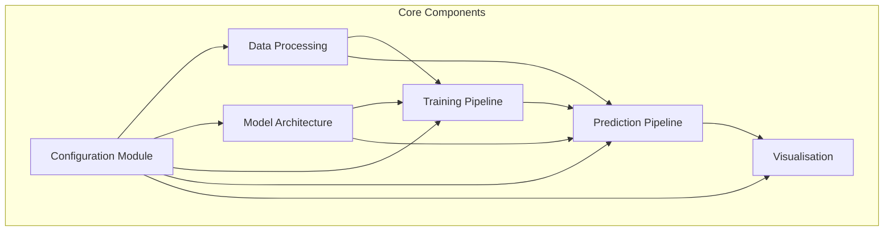

### Layer Structure

The package is organised in logical layers:

1. **Configuration Layer**: Manages all settings and parameters
2. **Data Layer**: Handles data loading, processing, and transformation
3. **Model Layer**: Defines model architecture and components
4. **Training Layer**: Manages model training and hyperparameter tuning
5. **Prediction Layer**: Provides inference and evaluation capabilities
6. **Visualisation Layer**: Creates plots and dashboards of results

## Key Components

### Configuration System

The configuration system provides centralised management of all parameters:

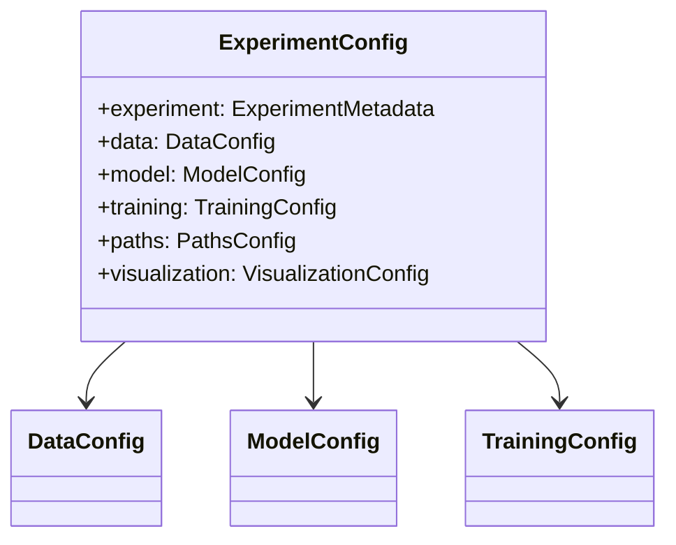

Key features:

- Hierarchical organisation of parameters
- Loading from YAML files
- Parameter validation
- Centralised access throughout the package

### Data Processing Pipeline

The data pipeline handles both spatial and temporal aspects of the data:

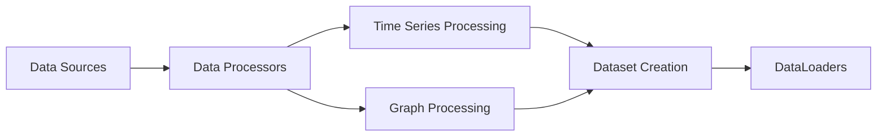

Key features:

- Support for file and API data sources
- Time series resampling and standardisation
- Graph creation from spatial relationships
- Integration of temporal and spatial features

### Model Architecture

The model architecture is based on a spatio-temporal graph neural network:

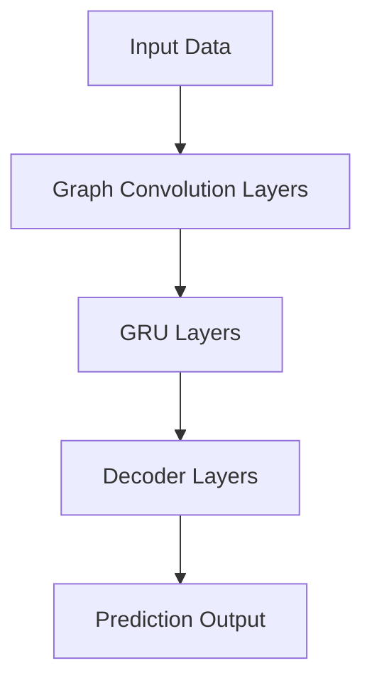

Key features:

- Graph convolution for spatial dependencies
- Recurrent layers for temporal patterns
- Attention mechanisms for focusing on relevant features
- Modular design for extensibility

### Training Pipeline

The training pipeline manages the model training process:

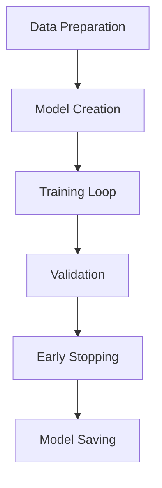

Key features:

- Support for cross-validation
- Early stopping for optimal training
- Progress tracking with tqdm
- Comprehensive logging of metrics

### Prediction Pipeline

The prediction pipeline handles inference and evaluation:

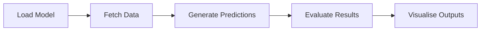

Key features:

- End-to-end prediction workflow
- Comparison with ground truth
- Calculation of error metrics
- Comprehensive visualisation options

### Hyperparameter Tuning

The package includes a sophisticated hyperparameter tuning system:

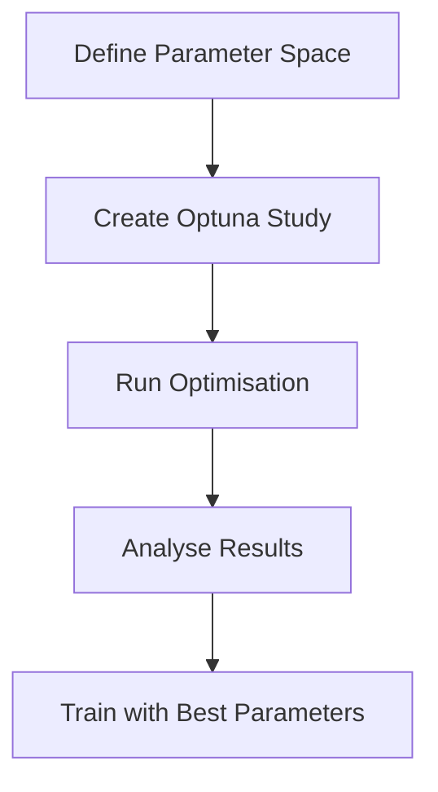

Key features:

- Integration with Optuna and MLflow
- Multi-stage tuning for efficiency
- Visualisation of parameter importance
- Results tracking and comparison

### Visualisation Components

The visualisation system provides comprehensive insights into predictions:

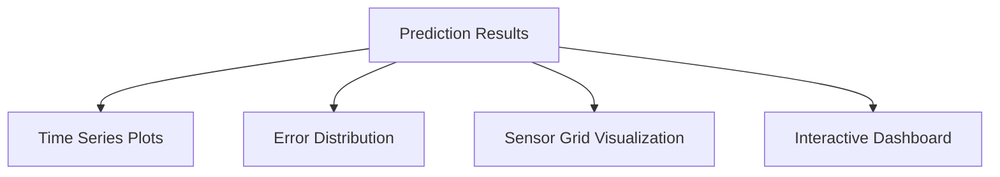

Key features:

- Time series plots for individual sensors
- Error analysis and distribution visualisation
- Grid views for comparing multiple sensors
- Optional interactive dashboards

## Main Workflows

### Training Workflow

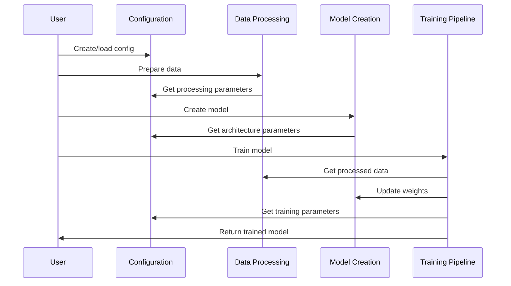

### Prediction Workflow

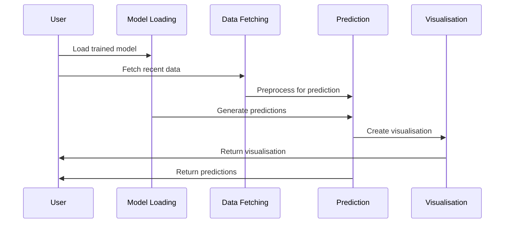

### Tuning Workflow

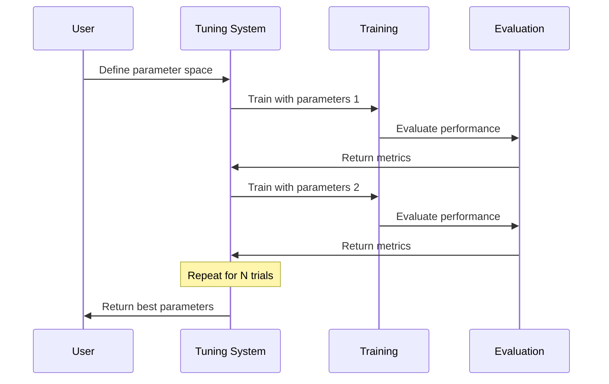

## Package Integration

The GNN package integrates with several external libraries and systems:

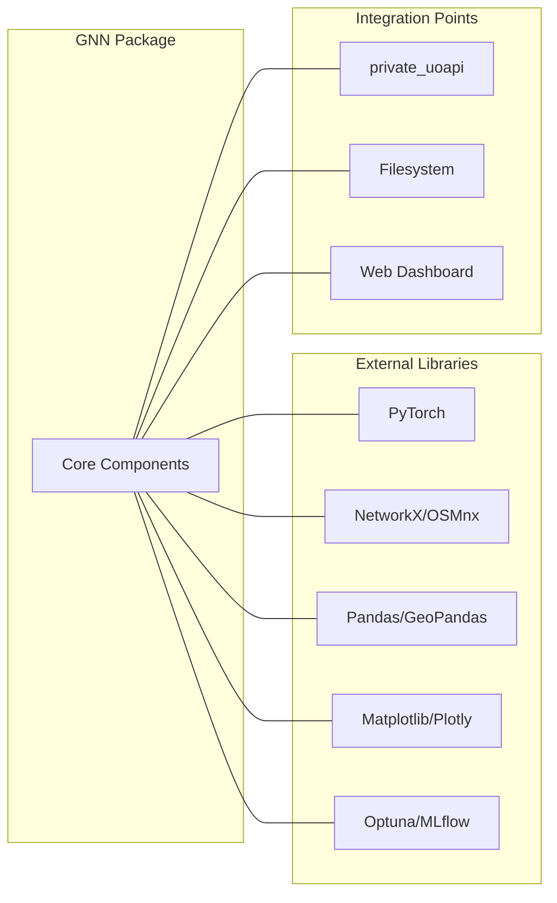

Key integration points:

- PyTorch for deep learning models
- NetworkX/OSMnx for graph operations
- Pandas/GeoPandas for data manipulation
- Matplotlib/Plotly for visualisation
- Optuna/MLflow for hyperparameter tuning
- private_uoapi for data fetching

## Directory Structure

The package is organised into the following directory structure:

```
gnn_package/
├── __init__.py
├── __main__.py
├── config.yml
├── config/
│   ├── config.py
│   ├── config_manager.py
│   └── paths.py
├── data/
│   ├── preprocessed/
│   ├── raw/
│   └── sensors/
├── src/
│   ├── data/
│   ├── dataloaders/
│   ├── models/
│   ├── preprocessing/
│   ├── training/
│   ├── tuning/
│   ├── utils/
│   └── visualization/
├── prediction_service.py
└── run_experiment.py
```

## Component Interactions

The interactions between key package components can be visualised as:

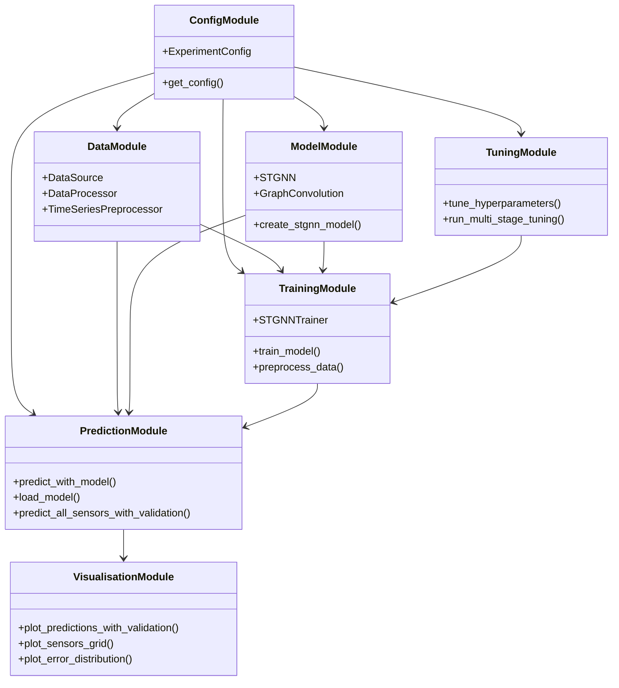

## Entry Points

The package provides several entry points for different use cases:

1. **run_experiment.py**: Main script for running training experiments
   ```bash
   python run_experiment.py --config config.yml --data data/raw/timeseries/test_data_1wk.pkl
   ```

2. **prediction_service.py**: Service for making predictions
   ```bash
   python prediction_service.py results/test_1wk/model.pth predictions/
   ```

3. **tune_model.py**: Script for hyperparameter tuning
   ```bash
   python tune_model.py --data data/raw/timeseries/test_data_1wk.pkl --trials 20
   ```

4. **__main__.py**: Module entry point for default training
   ```bash
   python -m gnn_package --config config.yml --data data/raw/timeseries/test_data_1mnth.pkl
   ```

## Getting Started

To use the GNN package:

1. **Setup Configuration**:
   ```python
   from gnn_package.config import get_config, create_default_config

   # Create a default config
   config = create_default_config("my_config.yml")

   # Or load existing config
   config = get_config("my_config.yml")
   ```

2. **Process Data**:
   ```python
   from gnn_package import training

   # Preprocess data
   data_loaders = await training.preprocess_data(
       data_file="data/raw/timeseries/test_data.pkl",
       config=config
   )
   ```

3. **Train Model**:
   ```python
   # Train model
   results = training.train_model(
       data_loaders=data_loaders,
       config=config
   )

   # Save model
   torch.save(results["model"].state_dict(), "model.pth")
   ```

4. **Make Predictions**:
   ```python
   from gnn_package.training import predict_all_sensors_with_validation

   # Predict
   predictions = await predict_all_sensors_with_validation(
       model_path="model.pth",
       config=config
   )
   ```

## Key Features and Capabilities

1. **Data Handling**:
   - Support for multiple data sources
   - Handling of missing values
   - Time series resampling and standardisation
   - Graph structure creation from spatial data

2. **Model Architecture**:
   - Graph convolution for spatial relationships
   - Recurrent layers for temporal patterns
   - Attention mechanisms for feature importance
   - Configurable architecture parameters

3. **Training**:
   - Cross-validation support
   - Early stopping
   - Progress tracking
   - Comprehensive metric logging

4. **Prediction**:
   - Real-time prediction capabilities
   - Comprehensive validation
   - Detailed error metrics
   - Visualisation of results

5. **Hyperparameter Tuning**:
   - Automated parameter optimisation
   - Multi-stage tuning
   - Integration with MLflow
   - Parameter importance analysis

## Extension Points

The package is designed to be extensible in several ways:

1. **Custom Data Sources**:
   - Implement the `DataSource` abstract class
   - Override the `get_data` method
   - Register with the `DataProcessorFactory`

2. **Alternative Model Architectures**:
   - Create a new model class
   - Implement a factory function
   - Update the configuration schema

3. **Custom Visualisations**:
   - Add new visualisation functions
   - Extend the dashboard generation
   - Implement interactive components

4. **Additional Metrics**:
   - Add new evaluation metrics
   - Extend the prediction analysis
   - Implement custom performance scoring

## Conclusion

The GNN package provides a comprehensive framework for traffic prediction using graph neural networks. Its modular architecture, extensive configuration options, and integrated workflows make it suitable for both research and operational use. By following the documentation for each component, users can leverage the full capabilities of the package for their specific needs.