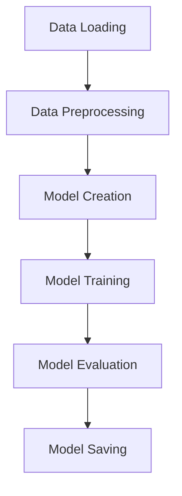
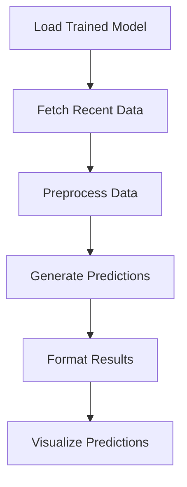
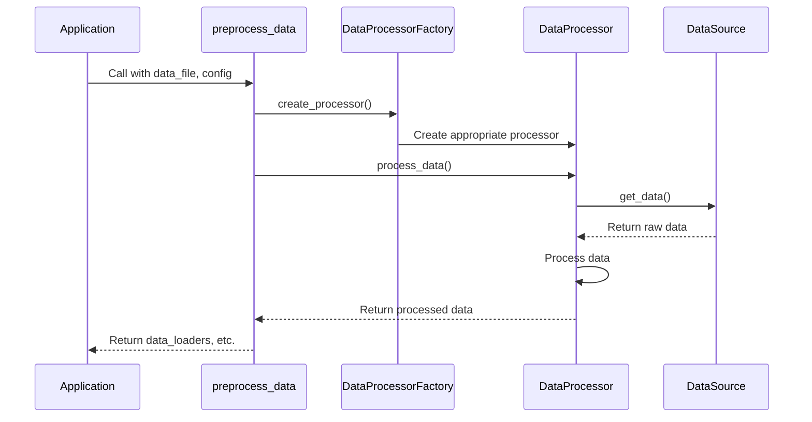
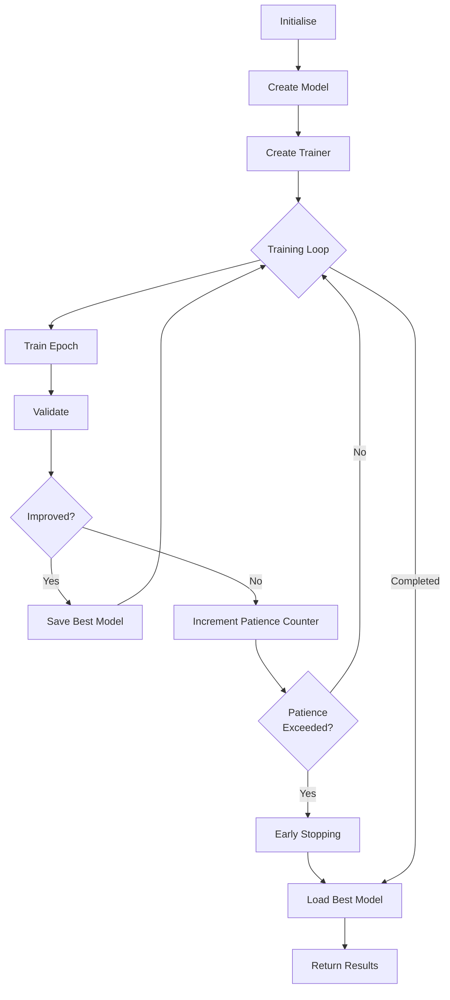
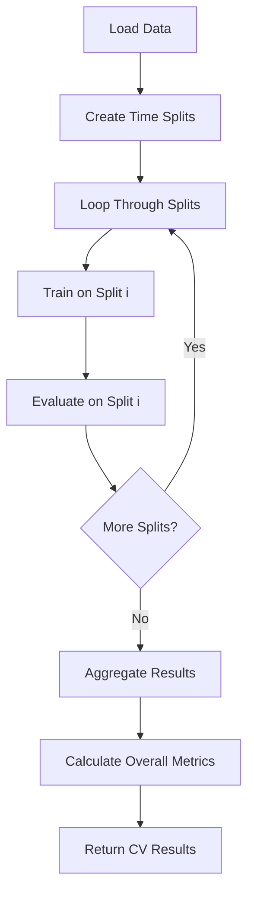
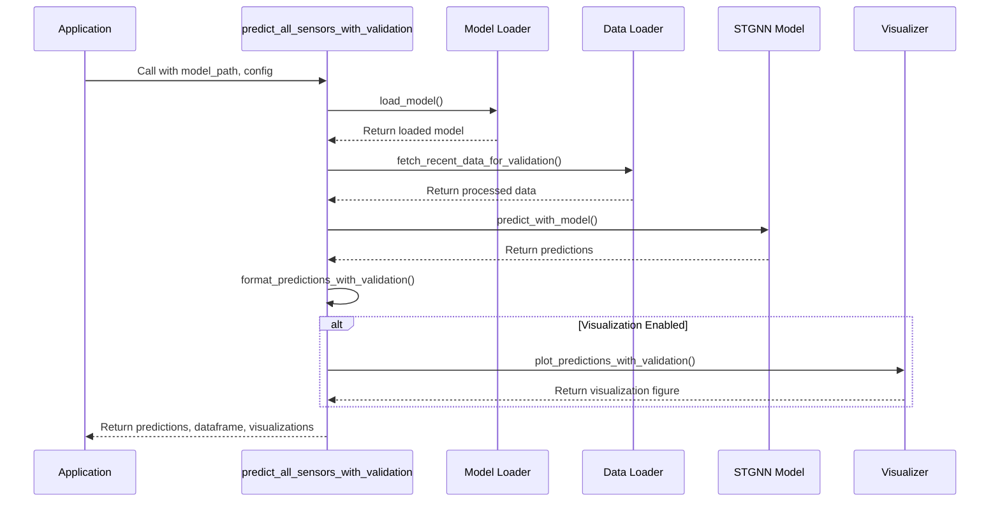
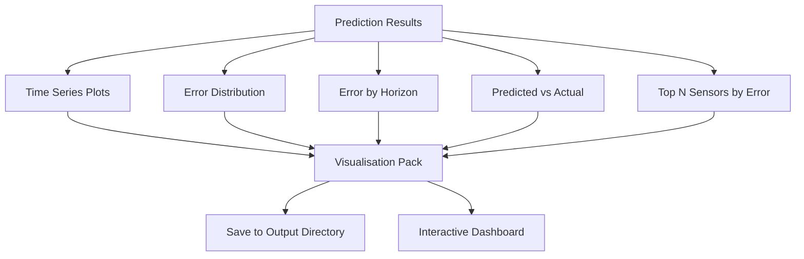
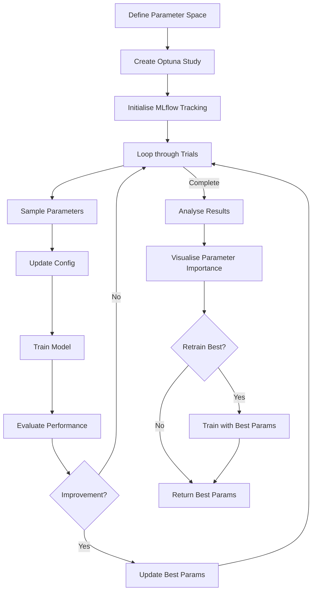
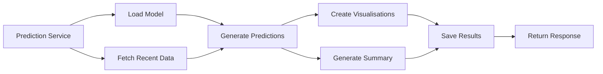
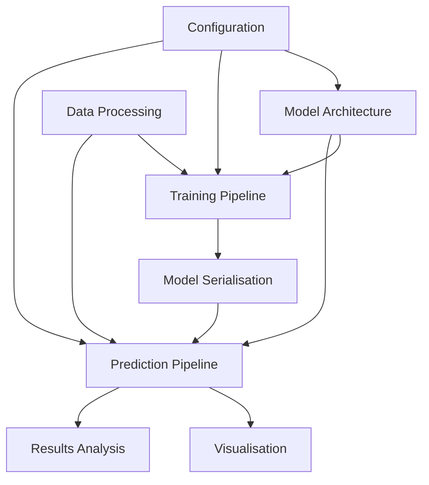

# GNN Package Training and Prediction Documentation

This document describes the training and prediction workflows in the GNN package, covering how models are trained, evaluated, and used for making predictions.

## Training Workflow Overview

The training process in the GNN package follows a structured workflow:



## Prediction Workflow Overview

The prediction process follows a similar but simplified workflow:



## Training Process in Detail

### Data Preparation for Training

Training begins with data preparation through the `preprocess_data` function:

```python
async def preprocess_data(data=None, data_file=None, config=None, mode=None, verbose=True):
    """Load and preprocess graph and sensor data for training."""
```

This function:

1. Loads data from file or uses provided data
2. Creates a `DataProcessor` instance via factory
3. Processes data according to the specified mode
4. Returns preprocessed data for model training

The function returns a structured dictionary containing:

- Data loaders for training and validation
- Graph data (adjacency matrix and node IDs)
- Time series data for validation
- Preprocessing metadata



### Model Training with train_model

The core training function is `train_model`:

```python
def train_model(data_loaders, config=None):
    """Train the STGNN model with progress bars"""
```

This function:

1. Creates a model from the configuration
2. Initialises a trainer
3. Trains for the specified number of epochs with early stopping
4. Returns the trained model and training metrics



The training loop includes:

- Progress tracking with tqdm
- Early stopping based on validation loss
- Learning rate scheduling (optional)
- Logging of training metrics
- Saving the best model

### Training with Cross-Validation

For more robust model training, the package supports cross-validation:

```python
def cross_validate_model(data=None, data_file=None, config=None):
    """Train and evaluate model using time-based cross-validation."""
```

This function:
1. Creates multiple time-based splits of the data
2. Trains a model on each split
3. Aggregates results across all splits
4. Returns comprehensive evaluation metrics



## Prediction Process in Detail

### Model Loading for Prediction

Prediction begins with loading a trained model:

```python
def load_model(model_path, config):
    """Load a trained STGNN model using parameters from config."""
```

This function:

1. Creates a model with the same architecture as training
2. Loads the saved state dictionary
3. Sets the model to evaluation mode
4. Returns the loaded model

For more sophisticated loading needs, the package provides:

```python
def load_model_for_prediction(model_path, config=None, override_params=None, model_creator_func=None):
    """Load a model with the appropriate configuration for prediction."""
```

This function additionally:

1. Attempts to find configuration in the model directory
2. Creates a prediction-specific configuration
3. Allows parameter overrides for prediction settings
4. Supports custom model creator functions

### Fetching Recent Data for Prediction

To make predictions on recent data, the system uses:

```python
async def fetch_recent_data_for_validation(config):
    """Fetch recent data for validation using the prediction data processor."""
```

This function:

1. Creates an API data source for real-time data
2. Creates a prediction-specific data processor
3. Processes data using prediction logic
4. Returns processed data ready for model input

### Making Predictions

The core prediction function is:

```python
def predict_with_model(model, dataloader, config):
    """Make predictions using a trained model and a dataloader."""
```

This function:

1. Determines the appropriate device for computation
2. Processes a batch of data through the model
3. Returns predictions and input data for validation

For end-to-end prediction, the package provides:

```python
async def predict_all_sensors_with_validation(model_path, config=None, output_file=None, plot=True):
    """Make predictions for all available sensors and validate against actual data."""
```

This comprehensive function:

1. Loads the model using appropriate configuration
2. Fetches and preprocesses recent data for validation
3. Makes predictions using the model
4. Formats the results into a structured DataFrame
5. Optionally creates visualisation plots
6. Returns the complete prediction results



### Formatting and Evaluating Predictions

To structure prediction results for analysis, the package provides:

```python
def format_predictions_with_validation(predictions_dict, time_series_dict, node_ids, config):
    """Format model predictions into a pandas DataFrame and include actual values for comparison."""
```

This function:

1. Extracts predictions and actual values
2. Calculates error metrics (MSE, MAE)
3. Creates a structured DataFrame with all relevant information
4. Returns the formatted results

The resulting DataFrame contains:

- `node_id`: Identifier for each sensor
- `sensor_name`: Human-readable sensor name
- `timestamp`: Prediction timestamp
- `prediction`: Predicted value
- `actual`: Actual value (for validation)
- `error`: Prediction error (prediction - actual)
- `abs_error`: Absolute error
- `horizon`: Prediction horizon (1-based index)

### Visualising Predictions

The package includes several visualisation functions for prediction results:

```python
def plot_predictions_with_validation(predictions_dict, data, node_ids, config):
    """Plot predictions alongside actual data for validation."""
```

```python
def plot_sensors_grid(predictions_df, plots_per_row=5, figsize=(20, 25)):
    """Create a grid of plots showing prediction vs actual values for all sensors."""
```

```python
def plot_error_distribution(predictions_df, figsize=(15, 10)):
    """Create plots showing the error distribution and patterns."""
```

These visualisation functions help evaluate model performance through:

- Time series plots comparing predictions to actual values
- Error distribution histograms
- Performance by prediction horizon
- Scatter plots of predicted vs actual values
- Sensor-specific error analysis



## Hyperparameter Tuning

The GNN package includes a comprehensive hyperparameter tuning system:

```python
def tune_hyperparameters(
    data_file, experiment_name, n_trials=20, n_epochs=None, output_dir=None, config=None,
    param_space=None, previous_best_params=None, retrain_best=True, study_name=None
):
    """Run hyperparameter tuning with Optuna and MLflow."""
```

This function:

1. Sets up an MLflow experiment for tracking
2. Creates an Optuna study for optimisation
3. Defines and samples from the parameter space
4. Trains models with different parameter combinations
5. Evaluates and tracks performance
6. Optionally retrains with the best parameters
7. Returns the best parameters and study information



### Multi-Stage Tuning

For more efficient tuning, the package supports multi-stage tuning:

```python
def run_multi_stage_tuning(
    data_file, experiment_name, output_dir=None, config=None,
    n_trials_stages=[20, 10, 5], n_epochs_stages=[10, 20, None],
    data_fraction_stages=[0.25, 0.5, 1.0]
):
    """Run multi-stage hyperparameter tuning with progressively more data and epochs."""
```

This approach:

1. Starts with less data and fewer epochs for fast initial exploration
2. Progressively increases data and epochs in later stages
3. Uses best parameters from previous stages to guide search
4. Balances exploration and exploitation efficiently
5. Provides comprehensive comparison across stages

## Training and Prediction Utilities

### Evaluation Metrics

The package calculates standard evaluation metrics:

```python
# Calculate MSE
mse = ((predictions - targets) ** 2).mean()

# Calculate MAE
mae = np.mean(np.abs(predictions - targets))
```

For masked data (with missing values), the metrics are calculated only on valid points:

```python
# MSE with mask
mse = np.mean(((predictions - targets) ** 2) * masks) / np.mean(masks)

# MAE with mask
mae = np.mean(np.abs(predictions - targets) * masks) / np.mean(masks)
```

### Saving and Loading Models

Models are saved with their configuration to ensure reproducibility:

```python
def save_model_with_config(model, config, path):
    """Save model and its configuration together."""
```

This function:

1. Saves the model state dict (`.pth` file)
2. Saves the configuration (`.yml` file)
3. Creates a directory structure for organisation

Loading maintains this reproducibility:

```python
def load_model_for_prediction(model_path, config=None, override_params=None, model_creator_func=None):
    """Load a model with the appropriate configuration for prediction."""
```

### Progress Tracking

Training progress is tracked with `tqdm` progress bars:

```python
class TqdmSTGNNTrainer(STGNNTrainer):
    """Extension of STGNNTrainer that adds progress bars using `tqdm`"""
```

This extension:

1. Shows overall training progress
2. Displays batch-level progress
3. Shows current loss values
4. Updates on validation performance
5. Indicates early stopping status

## Prediction Service

For operational use, the package includes a prediction service:

```python
async def run_prediction_service(model_path, output_dir=None, visualize=True):
    """Run the prediction service."""
```

This service:

1. Loads the model and configuration
2. Fetches recent data from the API
3. Generates predictions
4. Creates visualisations
5. Generates a summary report
6. Saves all outputs to the specified directory



## Integration with Other Components

The training and prediction components integrate with other parts of the GNN package:



## Key Files and Functions

- `src/training/stgnn_training.py`: Main training functions
  - `preprocess_data`: Prepares data for training
  - `train_model`: Trains a model with the specified configuration
  - `cross_validate_model`: Performs cross-validation

- `src/training/stgnn_prediction.py`: Prediction functions
  - `load_model`: Loads a trained model
  - `predict_with_model`: Makes predictions using a trained model
  - `predict_all_sensors_with_validation`: End-to-end prediction pipeline

- `src/tuning/tuning_utils.py`: Hyperparameter tuning utilities
  - `tune_hyperparameters`: Runs hyperparameter optimisation
  - `run_multi_stage_tuning`: Multi-stage tuning approach

- `prediction_service.py`: Operational prediction service
  - `run_prediction_service`: Main entry point for prediction service

## Best Practices for Training and Prediction

1. **Data Quality**: Ensure time series data is properly resampled and has minimal gaps

2. **Validation Strategy**: Use appropriate validation strategies based on data characteristics:
   - Time-based splits for sequential data
   - Rolling window validation for robust evaluation
   - Multiple validation splits to assess stability

3. **Hyperparameter Tuning**: Start with broad parameter ranges and refine:
   - Begin with multi-stage tuning for efficiency
   - Use parameter importance analysis to focus search
   - Balance model capacity with dataset size

4. **Model Evaluation**: Assess model performance comprehensively:
   - Examine error distributions across sensors
   - Analyse performance by prediction horizon
   - Compare against appropriate baselines

5. **Operational Use**: For prediction service:
   - Monitor prediction quality over time
   - Retrain models periodically with new data
   - Validate predictions against ground truth when available

## Summary

The training and prediction components of the GNN package provide a comprehensive framework for:

- Training spatio-temporal GNN models on traffic data
- Optimising model hyperparameters with efficient tuning
- Making predictions with trained models
- Evaluating prediction quality with visualisations
- Running operational prediction services

These components work together with the data processing and model architecture to create an end-to-end pipeline for traffic prediction.
